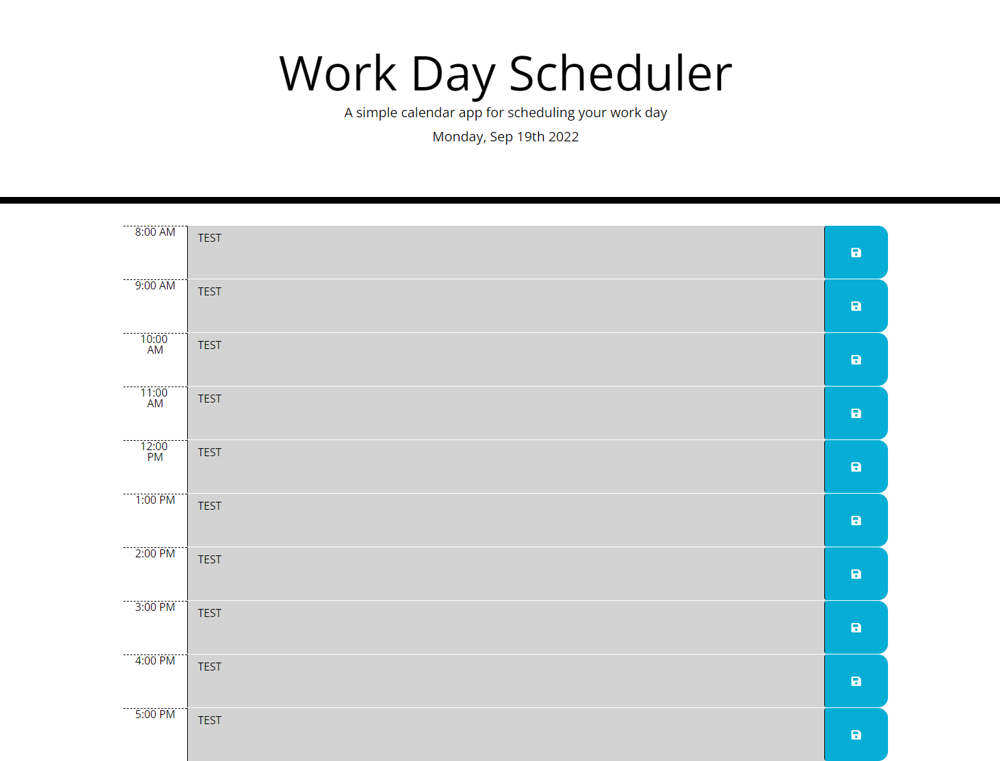

# Daily-Planner Description

    This is a basic browser daily planner to schedule your work day from 8 a.m - 5 p.m.

        - It's run by HTML, CSS, and Javascript.

        - At the top of the page it shows the current day and date.

        - You can write what you need to get done in whichever time block is relevant and save it to the localStorage. That way it stays on the page even after refresh it. 

        - The time blocks will be color coded based on the time.
        
            Grey for past times.

            Red for the present time.

            Green for future times.

        - In the HTML, CSS, and Javascript I left comments for easy navigation for all of these features and more.

## Daily-Planner Screenshot

I will probably update this screenshot during a time between 8 a.m - 5 p.m. Just so the screenshot shows more of the planners functionality during the relevant times.

### Daily-Planner Deployed Github Link

https://kjkhalil.github.io/Daily-Planner/